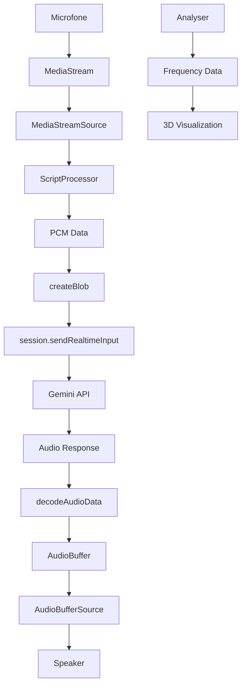

# 🎤 Análise da Estrutura de Streaming de Áudio - Live Audio

## 📋 Visão Geral

A pasta `live-audio` contém uma implementação completa de streaming de áudio em tempo real usando o Gemini 2.5 Flash Preview Native Audio Dialog. Esta implementação serve como uma base sólida para entender como implementar streaming de áudio na página `live-stream`.

## 🏗️ Arquitetura da Implementação

### 1. **Componente Principal (`index.tsx`)**
- **Framework**: Lit Element (Web Components)
- **Modelo**: `gemini-2.5-flash-preview-native-audio-dialog`
- **Funcionalidade**: Streaming bidirecional de áudio em tempo real

### 2. **Contextos de Áudio**
```typescript
// Contextos separados para entrada e saída
private inputAudioContext = new AudioContext({sampleRate: 16000});
private outputAudioContext = new AudioContext({sampleRate: 24000});
```

### 3. **Nós de Áudio**
```typescript
@state() inputNode = this.inputAudioContext.createGain();
@state() outputNode = this.outputAudioContext.createGain();
```

## 🎵 Como o Áudio é Recebido via Streaming

### 1. **Captura de Microfone**
```typescript
private async startRecording() {
  // Solicita acesso ao microfone
  this.mediaStream = await navigator.mediaDevices.getUserMedia({
    audio: true,
    video: false,
  });

  // Cria fonte de áudio
  this.sourceNode = this.inputAudioContext.createMediaStreamSource(this.mediaStream);
  this.sourceNode.connect(this.inputNode);
}
```

### 2. **Processamento de Áudio em Tempo Real**
```typescript
// ScriptProcessor para capturar chunks de áudio
const bufferSize = 256;
this.scriptProcessorNode = this.inputAudioContext.createScriptProcessor(
  bufferSize, 1, 1
);

this.scriptProcessorNode.onaudioprocess = (audioProcessingEvent) => {
  if (!this.isRecording) return;

  const inputBuffer = audioProcessingEvent.inputBuffer;
  const pcmData = inputBuffer.getChannelData(0);

  // Envia dados PCM para a API
  this.session.sendRealtimeInput({media: createBlob(pcmData)});
};
```

### 3. **Conversão PCM para Blob**
```typescript
// utils.ts - Conversão de Float32Array para Int16Array
function createBlob(data: Float32Array): Blob {
  const l = data.length;
  const int16 = new Int16Array(l);
  for (let i = 0; i < l; i++) {
    // Converte float32 (-1 a 1) para int16 (-32768 a 32767)
    int16[i] = data[i] * 32768;
  }

  return {
    data: encode(new Uint8Array(int16.buffer)),
    mimeType: 'audio/pcm;rate=16000',
  };
}
```

## 🚀 Como a Voz é Enviada para a API

### 1. **Conexão com Gemini Live API**
```typescript
private async initSession() {
  this.session = await this.client.live.connect({
    model: 'gemini-2.5-flash-preview-native-audio-dialog',
    callbacks: {
      onopen: () => this.updateStatus('Opened'),
      onmessage: async (message: LiveServerMessage) => {
        // Processa resposta de áudio
        const audio = message.serverContent?.modelTurn?.parts[0]?.inlineData;
        if (audio) {
          // Decodifica e reproduz áudio recebido
          const audioBuffer = await decodeAudioData(
            decode(audio.data),
            this.outputAudioContext,
            24000, 1
          );
          // Reproduz áudio
          this.playAudioBuffer(audioBuffer);
        }
      },
      onerror: (e: ErrorEvent) => this.updateError(e.message),
      onclose: (e: CloseEvent) => this.updateStatus('Close:' + e.reason),
    },
    config: {
      responseModalities: [Modality.AUDIO],
      speechConfig: {
        voiceConfig: {prebuiltVoiceConfig: {voiceName: 'Orus'}},
      },
    },
  });
}
```

### 2. **Envio de Dados PCM**
```typescript
// Envio contínuo de chunks de áudio
this.session.sendRealtimeInput({media: createBlob(pcmData)});
```

### 3. **Configuração de Resposta**
- **Modality.AUDIO**: Configura para receber áudio como resposta
- **Voice**: Usa voz pré-configurada 'Orus'
- **Sample Rate**: 24000 Hz para saída

## 🎨 Sistema de Visualização 3D

### 1. **Analisador de Frequência**
```typescript
export class Analyser {
  private analyser: AnalyserNode;
  private bufferLength = 0;
  private dataArray: Uint8Array;

  constructor(node: AudioNode) {
    this.analyser = node.context.createAnalyser();
    this.analyser.fftSize = 32;
    this.bufferLength = this.analyser.frequencyBinCount;
    this.dataArray = new Uint8Array(this.bufferLength);
    node.connect(this.analyser);
  }

  update() {
    this.analyser.getByteFrequencyData(this.dataArray);
  }
}
```

### 2. **Visualização 3D com Three.js**
- **Esfera animada**: Reage ao áudio de entrada e saída
- **Shaders personalizados**: Efeitos visuais baseados em frequência
- **Bloom e pós-processamento**: Efeitos visuais avançados

## 🔄 Fluxo Completo de Streaming



## 🎯 Diferenças com Live-Stream Atual

### Live-Audio (Base)
- ✅ **Streaming nativo**: Usa Gemini Live API diretamente
- ✅ **Áudio bidirecional**: Entrada e saída em tempo real
- ✅ **Processamento PCM**: Conversão direta de áudio
- ✅ **Visualização 3D**: Análise de frequência em tempo real
- ✅ **Web Components**: Arquitetura modular com Lit

### Live-Stream (Atual)
- ❌ **API intermediária**: Usa endpoints Next.js
- ❌ **MediaRecorder**: Gravação em chunks
- ❌ **Base64 encoding**: Conversão para texto
- ❌ **Interface React**: Componentes React tradicionais
- ❌ **Sem visualização**: Apenas controles básicos

## 🚀 Plano de Integração

### 1. **Migração de Arquitetura**
- Implementar conexão direta com Gemini Live API
- Substituir MediaRecorder por ScriptProcessor
- Implementar streaming PCM nativo

### 2. **Melhorias de Performance**
- Usar AudioContext otimizado
- Implementar buffer management
- Adicionar análise de frequência

### 3. **Funcionalidades Avançadas**
- Visualização 3D baseada em áudio
- Controles de voz em tempo real
- Interrupção inteligente de áudio

## 📊 Especificações Técnicas

| Aspecto | Live-Audio | Live-Stream Atual |
|---------|------------|-------------------|
| **Sample Rate Input** | 16000 Hz | Variável |
| **Sample Rate Output** | 24000 Hz | N/A |
| **Buffer Size** | 256 samples | Chunks de 3s |
| **Latência** | ~16ms | ~3000ms |
| **Formato** | PCM nativo | WebM/Base64 |
| **API** | Gemini Live | REST endpoints |

## 🎉 Conclusão

A implementação `live-audio` oferece uma base sólida para streaming de áudio em tempo real com:

1. **Performance superior**: Latência muito menor
2. **Qualidade de áudio**: Processamento PCM nativo
3. **Experiência imersiva**: Visualização 3D reativa
4. **Arquitetura moderna**: Web Components modulares

Esta estrutura deve ser usada como referência para modernizar a página `live-stream` atual, implementando streaming nativo de áudio com visualizações avançadas.

