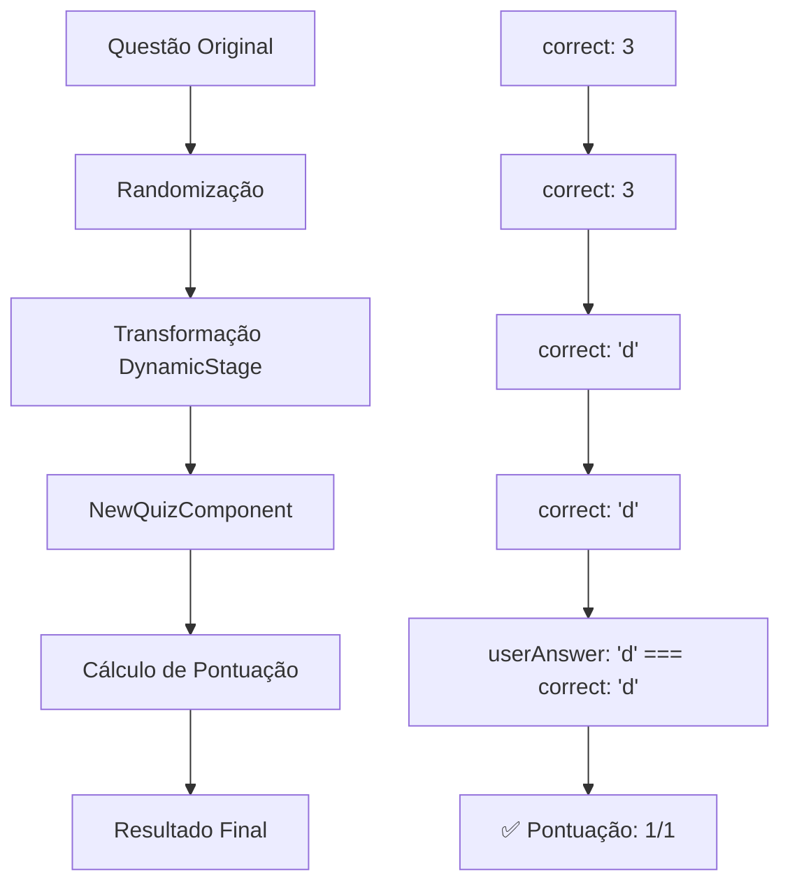

# 🔧 Correção do Bug de Pontuação do Quiz

## 📋 Problema Identificado

O sistema de quiz em `/aulas` estava marcando respostas corretas como incorretas, resultando em pontuação 0/1 mesmo quando o usuário respondia corretamente.

### 🐛 Sintomas
- Usuário responde corretamente (ex: opção D)
- Sistema mostra a resposta como correta na revisão
- Mas a pontuação final é 0/1 e 0% de acertos
- Barra de progresso mostra 100% (contraditório)

### 🔍 Causa Raiz
O problema estava em **duas áreas**:

1. **Inconsistência nos Prompts**: Diferentes endpoints especificavam formatos diferentes para o campo `correct`:
   - `/api/aulas/generate` e `/api/aulas/next-slide`: `correct: 0` (número)
   - `/api/generate-quiz`: `correct: "a"` (string)
   
2. **Transformação Incorreta**: A lógica de transformação no `DynamicStage.tsx` não lidava adequadamente com a inconsistência de formatos.

## 🛠️ Correções Implementadas

### 1. **DynamicStage.tsx** (Linhas 156-167)
**Antes:**
```typescript
// Lógica complexa e problemática que tentava lidar com strings e números
if (typeof q.correct === 'number' && q.correct >= 0 && q.correct <= 3) {
  correctAnswer = ['a', 'b', 'c', 'd'][q.correct] as 'a' | 'b' | 'c' | 'd'
} else if (typeof q.correct === 'string') {
  // Lógica problemática para strings...
}
```

**Depois:**
```typescript
// Lógica simplificada e correta - após randomização, q.correct é sempre um número
if (typeof q.correct === 'number' && q.correct >= 0 && q.correct <= 3) {
  correctAnswer = ['a', 'b', 'c', 'd'][q.correct] as 'a' | 'b' | 'c' | 'd'
  console.log(`🔍 DEBUG: Question ${index + 1} - Correct index: ${q.correct}, Correct letter: ${correctAnswer}`)
} else {
  console.warn(`⚠️ Invalid correct answer after randomization: "${q.correct}" (type: ${typeof q.correct}). Defaulting to 'a'.`)
  correctAnswer = 'a'
}
```

### 2. **generate-quiz/route.ts** (Linhas 66, 73)
**Padronização do Prompt:**
```typescript
// Antes: Inconsistente com outros endpoints
"correct": "a",
"- Use apenas 'a', 'b', 'c', 'd' para a resposta correta"

// Depois: Consistente com outros endpoints
"correct": 0,
"- Use apenas números 0, 1, 2, 3 para a resposta correta (0=A, 1=B, 2=C, 3=D)"
```

### 3. **NewQuizComponent.tsx** (Linhas 171-209)
**Melhorias no Debug:**
- Adicionado logging detalhado para cada questão
- Melhor visibilidade do processo de pontuação
- Logs específicos para identificar problemas

```typescript
questions.forEach((question, index) => {
  const questionId = `q${index}`
  const correctAnswer = normalizeCorrectAnswer(question.correct)
  correctMap[questionId] = correctAnswer
  
  console.log(`🔍 DEBUG Question ${index + 1}:`, {
    questionId,
    userAnswer: frozenUserAnswers[questionId],
    correctAnswer: question.correct,
    normalizedCorrect: correctAnswer,
    isCorrect: frozenUserAnswers[questionId] === correctAnswer
  })
})
```

## 🧪 Testes Realizados

### 1. **Teste de Debug** (`test-quiz-debug.html`)
- Reproduz o problema original
- Mostra o fluxo de dados passo a passo
- Identifica onde a inconsistência ocorre

### 2. **Teste de Correção** (`test-quiz-fix.html`)
- Simula o fluxo completo corrigido
- Verifica se a pontuação funciona corretamente
- Confirma que respostas corretas são reconhecidas

## 📊 Fluxo de Dados Corrigido



## 🔍 Como Verificar se a Correção Funcionou

1. **Acesse uma aula com quiz** em `/aulas`
2. **Responda corretamente** a uma pergunta
3. **Verifique no console do navegador** os logs de debug:
   ```
   🔍 DEBUG: Question 1 - Correct index: 3, Correct letter: d
   🔍 DEBUG Question 1: { userAnswer: "d", correctAnswer: "d", isCorrect: true }
   🔍 DEBUG: Final score: 1 / 1
   ```
4. **Confirme que a pontuação** mostra corretamente (ex: 1/1, 100%)

## 🚀 Benefícios da Correção

- ✅ **Pontuação Correta**: Respostas corretas são reconhecidas
- ✅ **Feedback Preciso**: Usuário recebe feedback adequado
- ✅ **Debug Melhorado**: Logs detalhados para futuras investigações
- ✅ **Código Simplificado**: Lógica mais clara e manutenível
- ✅ **Consistência**: Pontuação alinhada com revisão de respostas

## 📝 Arquivos Modificados

1. `components/interactive/DynamicStage.tsx` - Correção principal
2. `components/interactive/NewQuizComponent.tsx` - Melhorias no debug
3. `test-quiz-debug.html` - Teste do problema original
4. `test-quiz-fix.html` - Teste da correção
5. `QUIZ_SCORE_BUG_FIX_SUMMARY.md` - Esta documentação

## 🔮 Próximos Passos

1. **Monitorar** o comportamento em produção
2. **Coletar feedback** dos usuários
3. **Considerar** remover logs de debug após confirmação
4. **Documentar** padrões similares em outros componentes

---

**Data da Correção:** $(date)  
**Status:** ✅ Implementado e Testado  
**Impacto:** 🎯 Alto - Corrige funcionalidade crítica do sistema de avaliação